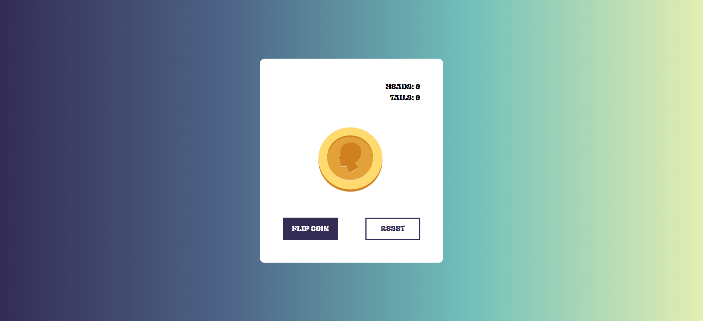

# Coin Flip Game

A simple interactive Coin Flip Game built with HTML, CSS, JavaScript, and [Tailwind CSS](https://tailwindcss.com/).

## 🚀 Features

- Smooth 3D coin flip animation using CSS.
- Tailwind CSS for a responsive and clean UI.
- Tracks number of heads and tails.
- Reset button to restart the game.
- Custom gradient background and Exile font from Google Fonts.

---

## 📸 Preview

---

## 🧠 How It Works

- When the **Flip Coin** button is clicked:
  - A random number (0 or 1) is generated.
  - Based on the result, a `spin-heads` or `spin-tails` animation is triggered.
  - Stats are updated after the animation completes (3 seconds).
  - The button is temporarily disabled during the animation.
- The **Reset** button clears the counters and stops the animation.

---

## 📁 File Structure

- `index.html` — Main HTML file for the game UI.
- `style.css` — Custom CSS for coin animation and layout.
- `script.js` — JavaScript logic for flipping the coin and updating stats.
- `head-coin.svg` — SVG image for the heads side of the coin.
- `tail-coin.svg` — SVG image for the tails side of the coin.

## 🧰 Technologies Used

- **HTML5**
- **Tailwind CSS (via CDN)**
- **Vanilla JavaScript**
- **CSS 3D Transforms** for flip animation
- **Google Fonts** (Exile)